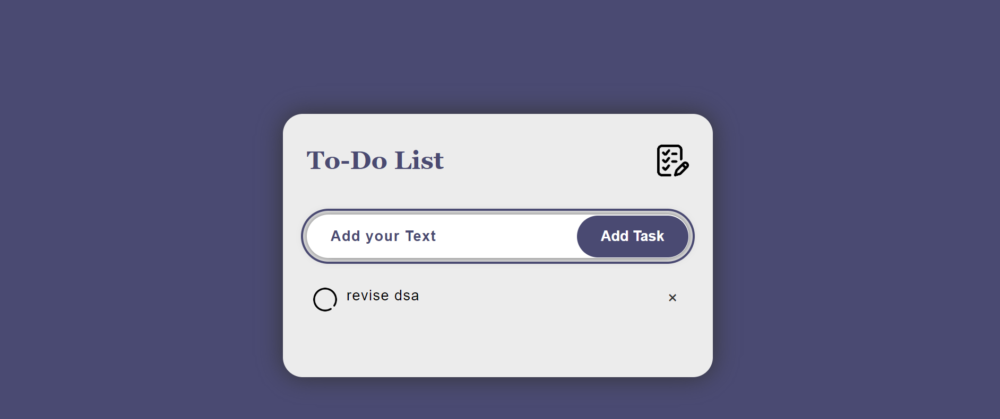

# To-Do List Application

A simple and intuitive To-Do List application to help you keep track of your tasks. This application allows users to add tasks, mark them as complete, and remove them as needed. The tasks are stored locally, so they persist even after refreshing the page.

## Live Demo

Check out the live demo of the application [here](https://react-projects-7uzi.vercel.app/).

## Features

- **Task Addition:** Users can add new tasks by typing in the input box and clicking the "Add Task" button.
- **Task Completion:** Click on a task to mark it as completed. Completed tasks are visually distinguished.
- **Task Removal:** Each task has a delete button (represented by a cross "×") to remove the task from the list.
- **Local Storage:** The tasks are saved in local storage, so they persist across browser sessions.

## Technologies Used

- HTML
- CSS
- JavaScript

## Project Structure

- **`index.html:`** The main structure of the To-Do List application.
- **`styles.css:`** Contains the styles and layout for the application.
- **`app.js:`** Includes the functionality to add, complete, and delete tasks, along with local storage management.

## Usage

1. Clone the repository or download the files.
2. Open the `index.html` file in your web browser to run the application.
3. Add tasks using the input box and "Add Task" button.
4. Click on tasks to mark them as completed.
5. Click the delete button (×) next to each task to remove it.

## Screenshots

### Main Interface

## How It Works

### Adding Tasks
- Type a task in the input box.
- Click "Add Task" to add the task to the list.

### Completing Tasks
- Click on any task to toggle its completion status. Completed tasks are styled differently for easy identification.

### Deleting Tasks
- Click the delete button (×) next to a task to remove it from the list.

### Saving Data
- The `saveData` function stores the current state of the task list in the browser's local storage.
- The `showTask` function retrieves and displays the saved tasks when the page is loaded.

